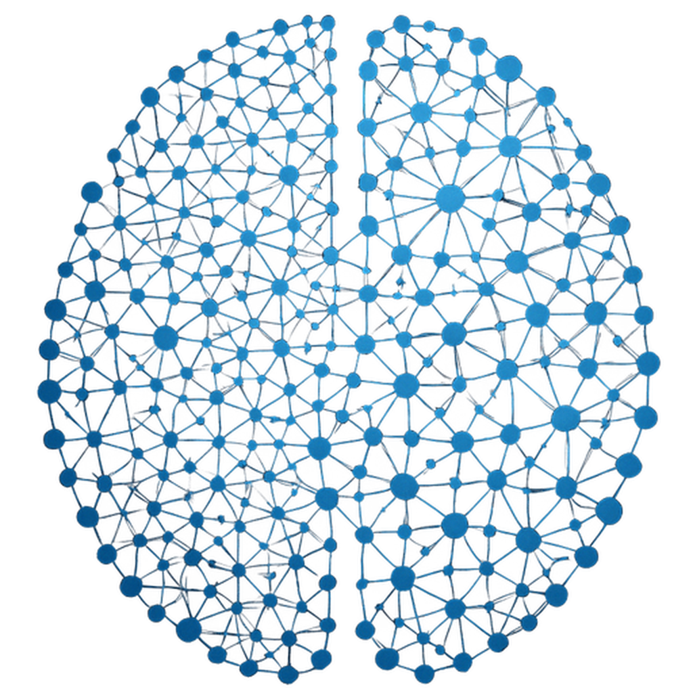

# Slides — Narrative-First Presentation Skill

Three-phase workflow: **Narrative Architecture** → **Slide Creation** → **PDF Export**.

---

## Phase 1: Narrative Architecture (Dot-Dash)

Before opening a single HTML file, build the storyline. A deck is an argument, not a slideshow.

### 1.1 Identify the Governing Thought

Every deck answers one question. The governing thought is your **answer** — a single assertion, not a topic:

> "We should invest in X because Y."
> "The program accelerates your trajectory from Z to W."
> "This quarter we accomplished A despite B."

If you can't write it in one sentence, you don't have a deck yet — you have a topic.

> **Answer-first principle:** State your conclusion before your evidence. The governing thought appears on the cover slide. The resolution appears in the first substantive slide, not the last. Every headline states the answer, never the question. Business audiences want the punchline immediately.

The governing thought sits atop a **pyramid** (Minto Pyramid Principle):

```
        Governing Thought
       /        |        \
  Key Line 1  Key Line 2  Key Line 3
   /  |  \      /  |        /  |  \
 Data Data    Data Data    Data Data
```

**Vertical logic:** Each level answers "Why?" or "How?" from the level above.
**Horizontal logic:** Arguments at the same level relate by deduction (A + B → therefore C) or induction (A, B, C share a pattern → conclusion).

Key line arguments become your slide headlines. Supporting data becomes your slide bodies.

### 1.2 Build the Ghost Deck (Dot-Dash Outline)

Write one **headline** per slide (the "dot") and 2-4 **supporting points** (the "dashes") underneath. Ideal is 3 points (human working memory handles 3±1 items). Headlines are assertions, never labels (exception: section divider slides in 10+ slide decks may use topic labels).

**Bad:** "Market Overview"
**Good:** "The market is shifting from compliance-driven to intelligence-driven"

**Bad:** "Our Team"
**Good:** "Three domain experts cover regulation, engineering, and go-to-market"

Format:

```
SLIDE 1 (Cover):  [Deck title — governing thought as headline]
SLIDE 2:  [First assertion that sets up the problem/context]
  - Evidence point 1
  - Evidence point 2
  - Key data or quote
SLIDE 3:  [Second assertion that deepens the problem]
  - Supporting detail
  - Contrasting data
SLIDE 4:  [Pivot — the resolution or opportunity]
  - How it works
  - Why it's different
...
SLIDE N:  [Call to action or conclusion]
  - Next step
  - Contact / pricing
```

### 1.2b MECE Check

Every level of your dot-dash must be **Mutually Exclusive, Collectively Exhaustive**:

- **ME:** No two headlines argue the same point. No two dashes repeat evidence.
- **CE:** Together, the headlines cover the full argument. No obvious gap a skeptic could point to.

Test each group of bullets: "Do any overlap?" (merge them). "What's missing that a critic would ask about?" (add it). MECE structure is a credibility signal — executives use it as a proxy for analytical rigor.

### 1.2c Slide Anatomy (Map During Dot-Dash)

Each slide has four zones. Map them during planning, not after:

| Zone | Content | Dot-Dash Mapping |
|------|---------|-----------------|
| **Action title** | Assertion headline (1-2 lines) | The "dot" |
| **Subtitle** | Scope, qualifier | Optional — note if needed |
| **Body/exhibit** | Chart, table, text proving the title | The "dashes" |
| **Source line** | Data attribution | Note sources now — unsourced numbers destroy credibility |

### 1.3 The Headline Test

Read the headlines aloud in sequence as a paragraph. They should tell a coherent story without supporting detail. If the narrative breaks, restructure before building slides.

For decks >10 slides, also read only the section-level key lines — they should form an executive summary.

### 1.3b The "So What?" Test

After the headline test passes, apply per-slide: read the headline, ask "So what? Why does this matter to the decision?" If you can't connect it to the governing thought in one sentence, cut the slide.

### 1.4 Narrative Arcs

Choose the arc that fits your deck type:

| Arc | Pattern | Best For |
|-----|---------|----------|
| **SCR** | Situation → Complication → Resolution | Pitches, proposals, enrollment docs |
| **SCQA** | Situation → Complication → Question → Answer | Board papers, decision memos |
| **What-So What-Now What** | Finding → Implication → Action | Recap decks, session summaries |
| **Before/During/After** | Past state → Transformation → Current state | Progress reports, case studies |
| **Problem-Mechanism-Proof** | Pain → How we solve it → Evidence it works | Product decks, demos |
| **Recommendation-Rationale-Risk** | What to do → Why → What could go wrong | Investment committee papers |

For decks >10 slides, add an **executive summary slide** after the cover containing all key lines. This enables non-linear consumption — executives read the summary and dive into the section that interests them.

### 1.5 Slide Type Assignment

Tag each slide in your dot-dash with its visual type. This determines layout in Phase 2.

| Type | Use For | Elements |
|------|---------|----------|
| `cover` | Slide 1 always | Hero title, subtitle, badge, date |
| `welcome` | Personalized openers | Two-column: greeting + note card |
| `comparison` | Before/after, gap analysis | Two-column card stacks |
| `pipeline` | Workflows, processes | Horizontal cards with connectors |
| `data-matrix` | Feature grids, person-tool maps | Tabular layout with cells |
| `cards` | Issues, pain points, benefits | Card grid (2-4 cards) |
| `metrics` | Impact, results, KPIs | Hero numbers with context |
| `recommendations` | Action plans, roadmaps | Phased list with CTA |
| `diagram` | Architecture, network topology | SVG with floating labels |

---

## Phase 2: Slide Creation

### 2.1 Color Palette (Light Mode)

```css
:root {
  --bg: #f5f3ee;                      /* warm cream — never pure #ffffff */
  --gold: #5c4a12;                    /* primary accent — 8:1 contrast */
  --gold-light: #4a3d10;             /* emphasis text — 10:1 contrast */
  --gold-glow: rgba(92, 74, 18, 0.12);
  --gold-subtle: rgba(92, 74, 18, 0.06);
  --gold-border: rgba(92, 74, 18, 0.40);
  --gold-card-fill: rgba(92, 74, 18, 0.06);
  --gold-card-border: rgba(92, 74, 18, 0.25);
  --card-fill: rgba(10, 25, 41, 0.05);
  --card-border: rgba(10, 25, 41, 0.12);
  --text-primary: #0a1929;           /* near-black navy */
  --text-secondary: #162d48;
  --text-muted: #3a5068;
  --font-display: 'Cormorant Garamond', Georgia, serif;
  --font-body: 'Outfit', sans-serif;
}
```

**Rules:**
- Background is `#f5f3ee` (warm cream), never pure white — prevents washed-out look
- No red/green/traffic-light colors. Differentiate with gold intensity levels only
- Card fills: navy-tinted `rgba(10,25,41, 0.05-0.06)` or gold-tinted `rgba(92,74,18, 0.05-0.09)`
- Card borders: 1.5px width always. `rgba(10,25,41, 0.12-0.15)` or `rgba(92,74,18, 0.25-0.45)`

### 2.2 Typography

**All sizes in px. Never rem.**

Font weights are bumped +100 from dark-mode equivalents for light-background legibility.

**Executive slides** (3-6 elements, "back of the room" readable):

| Element | Size | Font | Weight |
|---------|------|------|--------|
| Hero title (cover) | 80-92px | Cormorant Garamond | 300 |
| Slide title | 48-64px | Cormorant Garamond | 300 |
| Card/section titles | 36-48px | Outfit | 500-600 |
| Body text | 28-36px | Outfit | 400-500 |
| Labels, badges | 18-22px | Outfit | 500-600 |

**Data-dense slides** (matrices, pipelines, 4+ columns, 20+ cells):

| Element | Size | Notes |
|---------|------|-------|
| Chrome (footer, stat labels) | 11-14px | Glanced, not read |
| Cell text, descriptions | 14-18px | Main content |
| Section/card titles | 28-36px | Hierarchy markers |
| Slide title | 48-56px | Consistent |

**Emphasis:** `font-weight: 500; font-style: italic; color: var(--gold);`

### 2.3 Slide Skeleton

Every slide is a self-contained HTML file with inline `<style>`. No external CSS.

```html
<!DOCTYPE html>
<html lang="en">
<head>
  <meta charset="UTF-8" />
  <meta name="viewport" content="width=device-width, initial-scale=1.0" />
  <title>[Slide Title]</title>
  <link rel="preconnect" href="https://fonts.googleapis.com">
  <link rel="preconnect" href="https://fonts.gstatic.com" crossorigin>
  <link href="https://fonts.googleapis.com/css2?family=Cormorant+Garamond:ital,wght@0,300;0,400;0,500;0,600;1,300;1,400;1,500&family=Outfit:wght@300;400;500;600;700&display=swap" rel="stylesheet">
  <style>
    :root { /* palette from Section 2.1 */ }
    * { margin: 0; padding: 0; box-sizing: border-box; }
    html, body { width: 1920px; height: 1080px; overflow: hidden; }
    .slide {
      width: 1920px; height: 1080px;
      background: var(--bg);
      position: relative;
      display: flex; flex-direction: column;
    }
    /* ... slide-specific styles ... */
  </style>
</head>
<body>
  <div class="slide">
    <div class="ambient"></div>
    <div class="contours">
      <svg viewBox="0 0 1920 1080" preserveAspectRatio="none" fill="none">
        <!-- subtle contour lines -->
      </svg>
    </div>
    <div class="corner tl"></div>
    <div class="corner br"></div>
    <header class="header">
      <div class="logo-cluster">
        
        <span class="logo-text">COMPANY NAME</span>
      </div>
      <span class="header-meta">[Context]</span>
    </header>
    <main class="content">
      <!-- Slide content -->
    </main>
    <footer class="footer">
      <span class="footer-label">[Left context]</span>
      <span class="footer-label">[Right context]</span>
    </footer>
  </div>
</body>
</html>
```

### 2.4 Signature Design Elements

**Corner frames:** L-shaped brackets at top-left and bottom-right.
- Cover: 100px arms, 40px offset from edge, 1.5px stroke
- Content: 80-100px arms, 32-40px offset, 1.5px stroke

```css
.corner { position: absolute; width: 100px; height: 100px;
  border-color: var(--gold-border); border-style: solid; border-width: 0; }
.corner.tl { top: 40px; left: 40px; border-top-width: 1.5px; border-left-width: 1.5px; }
.corner.br { bottom: 40px; right: 40px; border-bottom-width: 1.5px; border-right-width: 1.5px; }
```

**Ambient gradients:** Layered radial gradients on `.ambient` div. Gold-tinted default, vary per slide.

```css
.ambient {
  position: absolute; inset: 0; pointer-events: none;
  background:
    radial-gradient(ellipse at 35% 50%, rgba(92,74,18,0.07) 0%, transparent 50%),
    radial-gradient(ellipse at 80% 30%, rgba(10,25,41,0.04) 0%, transparent 40%);
}
```

**Contour lines:** Subtle SVG quadratic bezier curves at very low opacity (0.02-0.04).

**Gold divider:** `linear-gradient(90deg, transparent, var(--gold), transparent)` — 120px wide, 2px tall.

**Badges/pills:** `border-radius: 100px`, gold fill or subtle fill + gold border, with 8px solid dot.

### 2.5 Design Rules

1. **All px, never rem** — every size, padding, and gap
2. **No partial borders** — full `border: 1.5px solid` or no border. Never `border-left` only
3. **Subtle fills only** — `rgba(gold, 0.03-0.09)` backgrounds. No opaque fills
4. **Fill vertical space** — `flex: 1` on content. Bottom 30% must have content. Center vertically when natural
5. **Corner clearance** — header/footer must clear corner brackets. Header top >= corner offset + 8px
6. **SVG connectors edge-to-edge** — lines between boxes start at edge, not center. Calculate actual intersection points, not center-to-center
7. **No overlapping elements** — process lines, decorative elements, connecting graphics must not overlap text or titles. Never use a `::before` pseudo-element spanning full width at a fixed `top` — it will cut through content. Use discrete SVG arrows in gaps between columns instead
8. **Executive body text minimum 22px** on 1920x1080. Labels >= 18px (chrome/footer exempt at 14-16px for data-dense). Titles >= 28px. Absolute floor: **16px**
9. **White space for breathing, not emptiness** — if cards have >40% empty space, increase font sizes or reduce card count
10. **Redundant visual encoding** — every zone communicates through >=2 visual channels (color + shape minimum)
11. **Zone-specific shape language** — border-radius is semantic: sharp (8-10px) = urgency, measured (14-16px) = precision, rounded (20px) = resolution, generous (24px) = comfort
12. **Phone readability** — decks reviewed on phones at ~0.2x scale. Fewer words at larger sizes > dense small text

### 2.5b Anti-Patterns (Avoid These)

These are learned from production use. Every rule here fixes a real failure mode.

13. **No eyebrow labels above titles** — uppercase category labels like "HOW IT WORKS" or "WHY IT WORKS" above the slide title are AI slop. The title should speak for itself. Cut the eyebrow entirely
14. **No pill/bubble tags** — monospace pills listing outputs ("Governing thought", "MECE check") look like generic dashboards, not professional slides. Use full sentences in bullet descriptions instead
15. **Text must fill its container** — the single most common failure. If a card's text occupies less than 60% of the card's area, either increase font sizes, add content, or remove the card. Small text in a big box looks unfinished
16. **Remove cards when content works without them** — swatches + text often look better floating on the background than trapped inside bordered rectangles. Cards are for grouping, not decoration. If the content has its own visual structure (icons, font previews, color swatches), it doesn't need a box
17. **Vertical distribution** — wrap the main content area in `flex: 1; justify-content: center` so content sits in the vertical middle of the slide. Never bunch everything at the top with 40%+ empty space below
18. **Section subheadings** — when dividing a slide into sections, use a left-aligned Cormorant heading with a gold gradient line extending to the right (`linear-gradient(90deg, var(--gold-border), transparent)`). Never use centered italic text as a section break
19. **Consistent title placement** — all content slides must use the same title font-size (48px) and padding (`20px 56px 0`). Inconsistent title sizes across slides in a deck look amateurish
20. **Sentences over fragments** — bullet descriptions should be complete thoughts that explain what happens, not just keyword labels. "Build a dot-dash outline with assertion headlines and supporting evidence" beats "Dot-dash outline"
21. **Map structure to content** — when showing categorized information, group items under their category with visual anchors (left-border accents, column grouping, intensity gradients). Don't flatten hierarchical data into a generic grid

### 2.6 Branding (Customizable)

Default ships with Olito Labs assets. To use your own:

1. Replace `assets/logo.png` with your logo (transparent PNG, ~44px height rendered)
2. Update `.logo-text` content in each slide's HTML
3. Adjust `--gold` family to your brand's accent color (maintain >= 7:1 contrast ratio on `#f5f3ee`)
4. Update footer text

---

## Phase 3: PDF Export

### 3.1 Prerequisites

```bash
cd ~/.claude/skills/slides/scripts && npm install
```

### 3.2 Generate PDF

**Combined deck (most common):**
```bash
node ~/.claude/skills/slides/scripts/generate-pdf.js \
  --input /path/to/slides/directory \
  --output /path/to/deck.pdf \
  --order slide_01_cover.html,slide_02_content.html,slide_03_data.html
```

**Single slide:**
```bash
node ~/.claude/skills/slides/scripts/generate-pdf.js \
  --input /path/to/slide.html \
  --output /path/to/slide.pdf
```

**Individual PDFs:**
```bash
node ~/.claude/skills/slides/scripts/generate-pdf.js \
  --input /path/to/slides/directory \
  --output /path/to/output/directory \
  --individual
```

### 3.3 How It Works

- Puppeteer with Chrome's unified headless mode (v22+)
- `emulateMediaType('screen')` to preserve CSS gradients and ambient glows
- 1920x1080 viewport at 2x device scale factor
- Slides merged via pdf-lib for combined decks

### 3.4 What Renders Correctly

CSS gradients, ambient glows, Google Fonts, SVG graphics, backdrop filters.

### 3.5 Avoid in Slides

- SVG `feTurbulence` noise filters (render as visible dots)
- Complex CSS filters on large areas
- Animations (static snapshot taken)

For troubleshooting, see `references/troubleshooting.md`.

---

## Validation Checklist

Run after every slide, before PDF export. Fix ALL before proceeding.

- [ ] **No rem/em** in any font-size — all px
- [ ] **No partial borders** — no `border-left` or `border-top` only
- [ ] **Within 1920x1080** — header + title + content + footer <= 1080
- [ ] **Footer visible** — not pushed offscreen
- [ ] **Corner clearance** — logo and page number never overlap corner lines
- [ ] **Vertical space filled** — bottom 30% has content
- [ ] **Font sizes match mode** — executive body >= 22px, data-dense body >= 14px
- [ ] **Card fills visible** — fills distinct from `#f5f3ee` background (opacity >= 0.05)
- [ ] **1.5px borders** — not 1px (disappears on light backgrounds)
- [ ] **No red/green** — only gold intensity levels for differentiation
- [ ] **SVG connectors edge-to-edge** — no lines piercing through boxes
- [ ] **Redundant visual encoding** — each zone has >= 2 visual signals
- [ ] **Palette correct** — bg is `#f5f3ee`, gold is `#5c4a12`, text-primary is `#0a1929`
- [ ] **No overlapping elements** — process lines and decorative graphics clear all text
- [ ] **Class names correct** — `.slide` not `.of-slide-container`, `.header` not `.slide-header`
- [ ] **No eyebrow labels** — no uppercase category text above the title
- [ ] **Text fills containers** — card text occupies 60%+ of card area. No small text in big boxes
- [ ] **Titles consistent** — all content slides use 48px title at same padding position
- [ ] **Content vertically centered** — main area uses flex centering, not top-bunched

### Post-PDF Quality Check

After generating the PDF, verify:

- [ ] Ambient glow visible and smooth (no banding)
- [ ] Background clean (no speckles or artifacts)
- [ ] Fonts loaded correctly (not fallback system fonts)
- [ ] All content fits within slide bounds (nothing cropped)
- [ ] Colors match browser preview

---

## Reference Examples

Before building any slide, read the closest archetype from `examples/`. Copy its structure, then customize.

| Example | Archetype | Use When Building... |
|---------|-----------|---------------------|
| `slide_01_cover.html` | Cover | Title slides, deck openers |
| `slide_02_content.html` | Two-column comparison | Gap analysis, before/after, welcome slides |
| `slide_03_data.html` | Card grid with metrics | Impact slides, KPIs, pain points, benefits |
| `slide_04_pipeline.html` | Horizontal pipeline | Workflows, processes, stage progressions, timelines |
| `slide_05_recommendations.html` | Recommendations + CTA | Action plans, investment slides, enrollment, pricing |

---

## Full Workflow Summary

```
1. NARRATIVE (Phase 1)
   └─ Write governing thought
   └─ Build dot-dash outline (headlines + evidence)
   └─ Run headline test (read headlines only — does the story hold?)
   └─ Assign slide types

2. BUILD (Phase 2)
   └─ Copy closest example archetype per slide
   └─ Copy assets/ into your deck directory
   └─ Customize content, following palette + typography + design rules
   └─ Run validation checklist per slide

3. EXPORT (Phase 3)
   └─ Generate combined PDF
   └─ Verify: fonts, gradients, space utilization, readability
```
